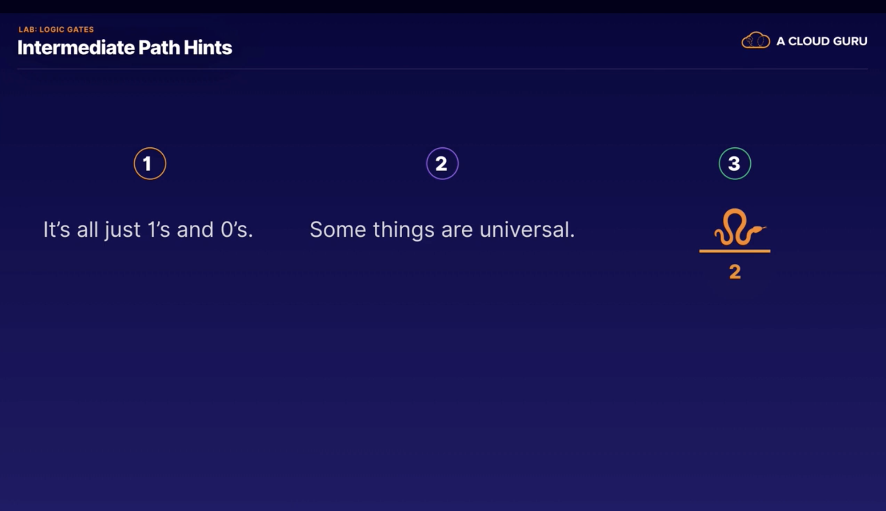
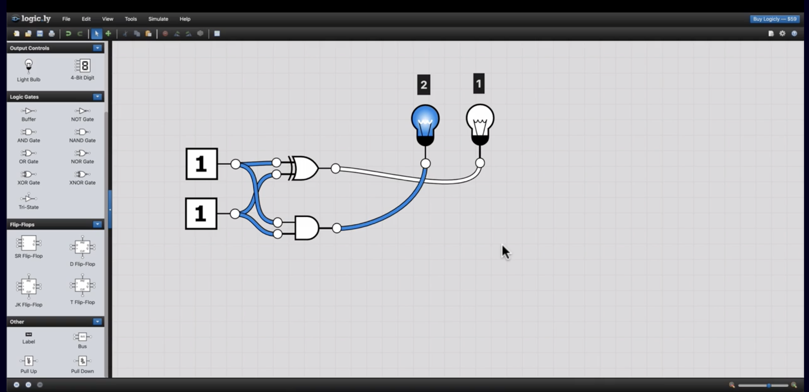
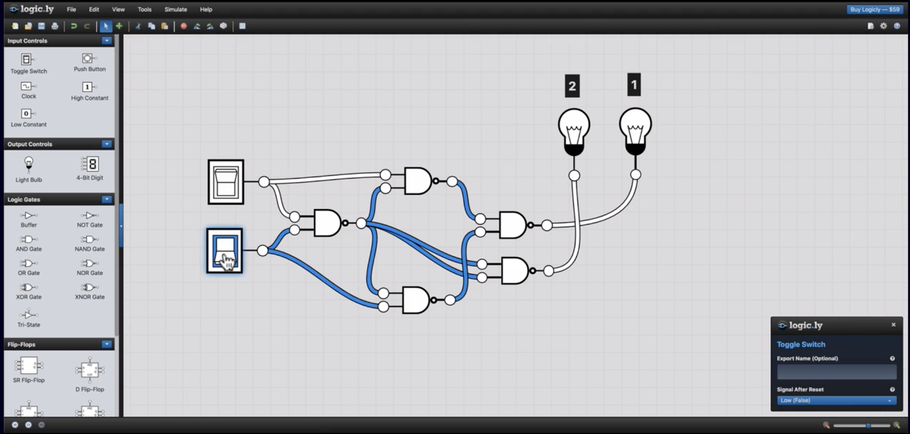
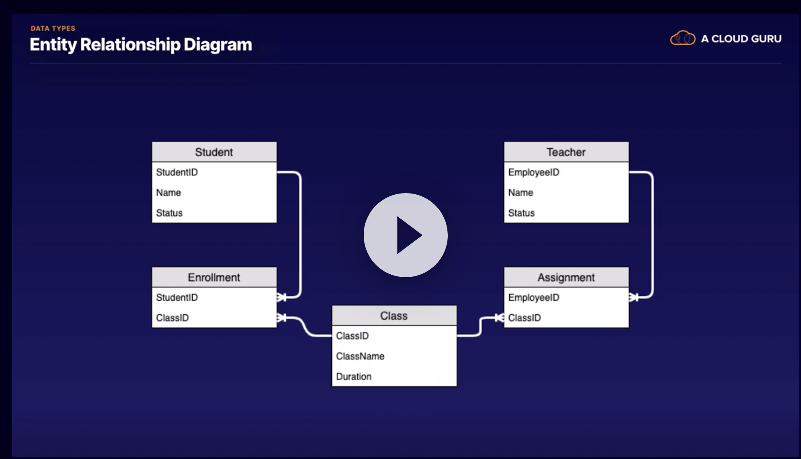

# Introduction to machine learning

## Section 2: History of machine learning

### Brief history of AI and ML 

- 'Electro' - robot from Westinghouse

- Talos - greek mythology, automaton

- Original computer programmers - manual switches and wiring

- Alan Turing - Automatic Computing Engine

- Turing - "Can machines think?"
 - Imitiation game/Turing test
 
- First Artificial intellegence program: Newell, Simon, 1955
 - Logic theory machine
 
- Early proposal for questions in "Artifiical Intelligence"
 - Automatic computers
 - How can a computer be programmed to use a language
 - Neuron nets: mimic the brain
 - Theory size of a calcualtion
 - Self-improvement
 - Abstraction
 - Randomness and creativity
 
Theorem: the past explains the present and gives us some intuition about the future

### Difference between AI, ML, statistics and data science

Arthur Samuel: Pioneer of computer gaming
 - Made program that plays checkers
 - Demonstrated reinforcement learning
 
#### Data science and Machine learning

Both: 

 - Uses computing power
 - Usually large sets of data
 - Lots of math

Data science:

 - Analyse the data to draw conclusions
 
 
Machine learning:

 - Attempts to perform tasks without explicit instructions
 
#### Artificial intelligence

Topics in AI include:

 - Expert systems
 - Speech
 - Natural language processing
 - Vision
 - Machine learning
 - Neural networks
 - Robotics

Common theme is building systems that figure things out on their own, or at least simulate that ability

#### Machine learning

Topics:

 - Ensemble
 - Reinforcement
 - Supervised
 - Unsupervised
 - Semi-supervised
 - More to come....
 
#### Machine learning models

What is a model?  Taking a problem or challenge as described by lots of data, adding a machine learning algortihm and, through computation, trying to digure out a mathematical formula that can accurately generalize about that problem.

Algorithm: 

 - unambiguous specification of how to solve a class of problems
 - Set of steps to follow to solve a specific problem
 - Intended to be repeatable with the same outcome

Heuristic:

 - A mental shortcut or 'rule of thumb' that proivides guidance on a task
 - Does not guarantee a consistent outcome
 
Example: troubleshooting why a computer doesn't work

Algorithm - set of steps that you can take to narrow down to the cause

Heuristic - educated guess 

Sometimes, we use heuristics because we just want a (cheap) answer that is 'good enough', rather than an (expensive) answer that is perfect

### Understand why computers compute 

#### Binary number systems

Binary numbering system: places represent powers of two.

Each position: bit
Eight bits: Byte

Each byte: 256 possible combinations

#### Logic gates

The basic building blocks of most modern computers

A debate between George Boole vs Sir William Hamilton prompted Boole to develop a system of logic that uses two states (TRUE, FALSE).

Digitial logic gates are an application of boolean logic

An AND gate: two inputs, one output; true if both inputs are true
An OR gate: two inputs, one output; true if one input is true
A NOT gate: one input, one output; true if input is not true

Two gates in series: AND and NOT - NAND: only false if both inputs are true

NAND gate is 'universal' - can build any other gate type with combinations of NAND gates

#### Challenge lesson: logic gates

Challenge - design a circuit that adds two numbers using only one circuit element

The hints were:

Use [logic.ly](https://logic.ly) to explore circuits.

The solution, using different kinds of logic gates

The solution, using only one kind of logic gate (NAND)

This is different to mine... But there are different solutions

## Data

Learning objectives:

1. Understand the different types of data
2. Understand the difference between structured, unstrctured and semi-structured data
3. Common ways we provide context to data

Key words:

 - schema
 - tensor
 - aggregation
 - normalization
 - feature engeineering
 
### Intro to data

The human computer: 100 billion neurons in a human brain.  Neurons have many more connections than transistors.  Intelligencs is more than logic.  Data drives intelligence.

Top layers are intelligence: 

 - Wisdom is knowledge over lots of time
 - Knowlege is making sense of information
 - Information is a collection of summarised things
 - Generalizations, probabilities, conclusions are tricks to summarise and understand

Structured data: 
 - adheres to some rules or formats that we can count on
 - easy for computers to access
 - examples: name, time, weekday
 
Unstructured data: 
 - data that isn't a format that we can count on 
 - hard for computers to access
 - example: picture, block of text, form, restraunt review
 
Semi-structured
 - in between structured and unstructured
 - brings along it's own strcture
 - e.g. JSON, YAML files
 
The goal of machine learning is often to structrure data more

## Data context

Context provides the "backstory" for data:

 - Where did it come from?
 - Who created it?
 - How was it collected or generated?
 - Is it trustworthy?
 
A schema: 

 - predefined blueprint of how data is structured and related
 - provide context for storing, reading and interpreting data
 - an entity relationship diagram is one way of representing a schema

A cannonical model:

 - a common format for exchanging data among systems
 
Data types:

 - integers
 - floating point
 - decimal (fixed number of decimal places)
 - bigint, smallint: integers when we had to care about memory usage
 - character
 - string
 - blob: binary large objct; video; audio; file
 
Composite datatypes:

 - tuple: a number of items (integers, characters, etc) in a list
 - array: a collection of items where each item can be identitfied by an index or key (e.g. dict) (sometimes called a vector)
 - matrix: an array in two dimensions
 - tensor: a collection of matrices / a generic multidimensional array
  - 1-D tensor / first order tensor: array
  - 2-D tensor / second order tensor: matrix
  - tensor: collection of matrices
  
Tensors are used for image regcnonition.  Images are broken up into RGB components - one matrix for red, one for green, one for blue

### Data preparation

Most of the work in developing machine learning models is in data preparation: cleaning, scrubbing, sanitising

Common problems:

 - formatting: e.g. data in columns not all the same type
 - missing values
 - duplicates
 - invalid data
 - encoding
 
 
STeps in data prepration:

 - Cleaning: sorting out these issues
 - Aggregation: summarising the data through consolidation
 - Transforming: converting to another format, unit or value
 - Normalisation: scale values relative to a constant value
 - Visualisation: gives us insights that we can't see just by looking at the data
 
Feature engineering: getting the data into the best possible shape for machine learning

### Data sets

We're after generalizations, not memorizations, if we want to learn from the data.  To do this, we often hold back some data when training the model to assess the generalisability of the model:

 - training dataset: for training model
 - validation dataset: 'check point' to see how training is going
 - testing dataset /  hold-out dataset: hold-back for testing final model

A reasonable split is 70-80% of the data for training the model, 20-30% of the data for testing.  An alternative is 70% training, 15% validation, 15% testing.  

The split should keep representative data in each set.  So it's important to randomise data before splitting.

But how to split time series data?  Time plays an important part in the context of the data, so we can't just take random days, or one period of time.  So we probably want the most recent data as the hold-out data.  But it can be very difficult to predict patterns that weren't in the training data

### Why it works

 
