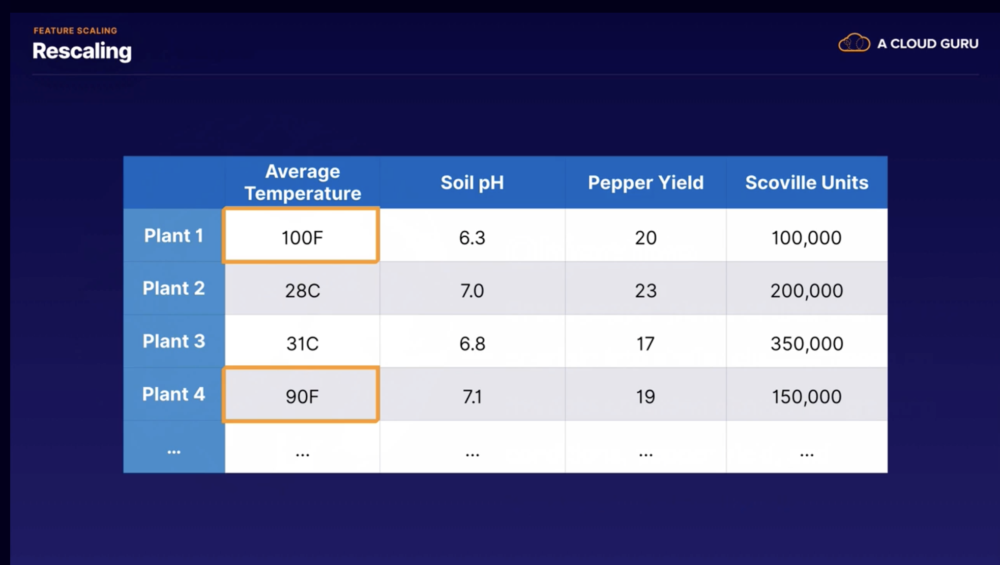
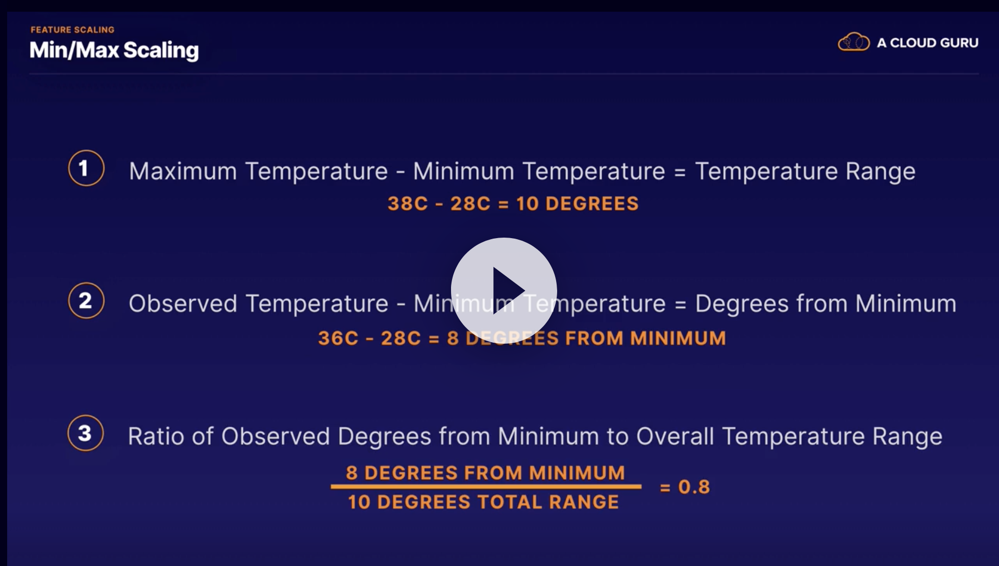
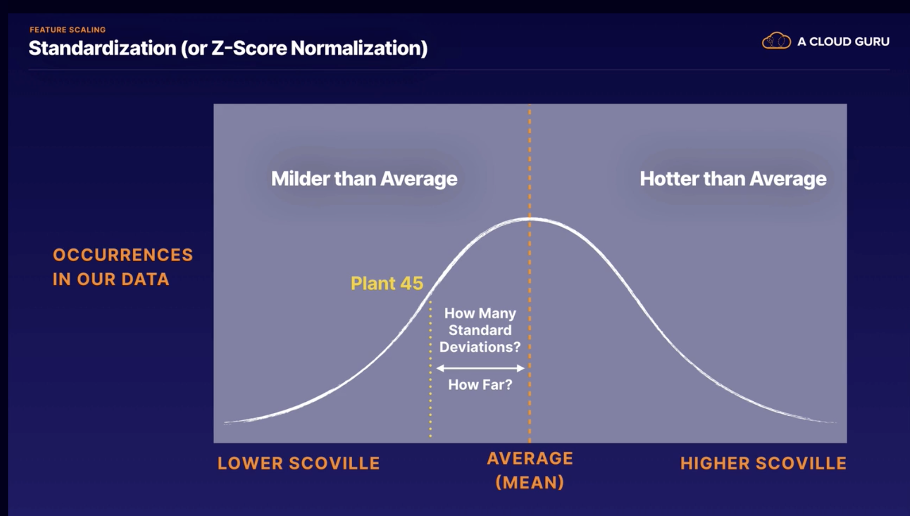
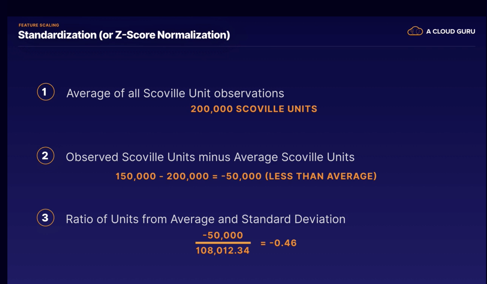
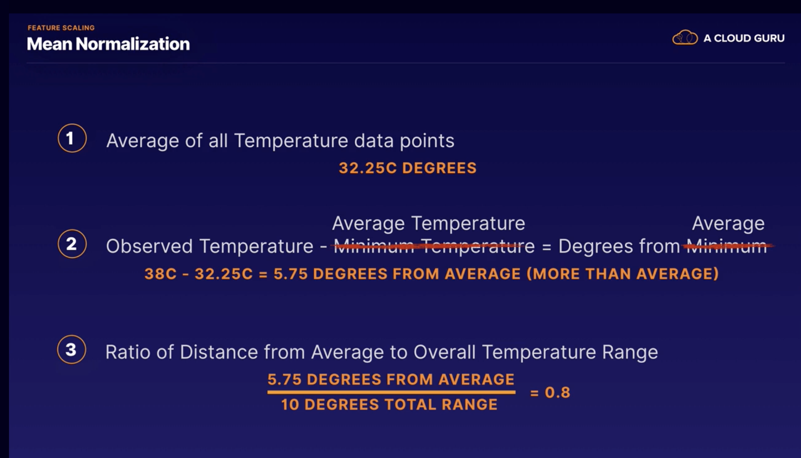
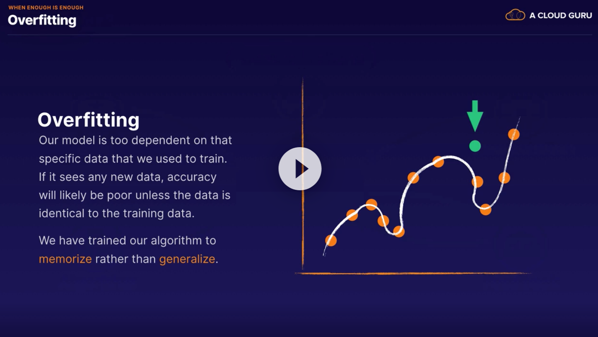
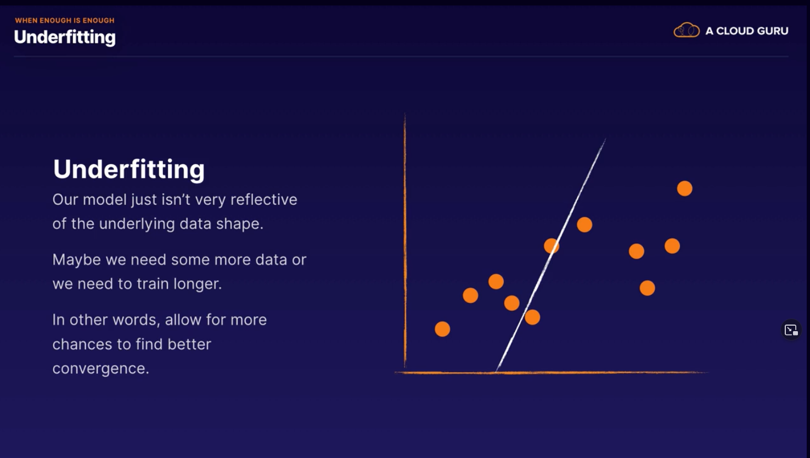
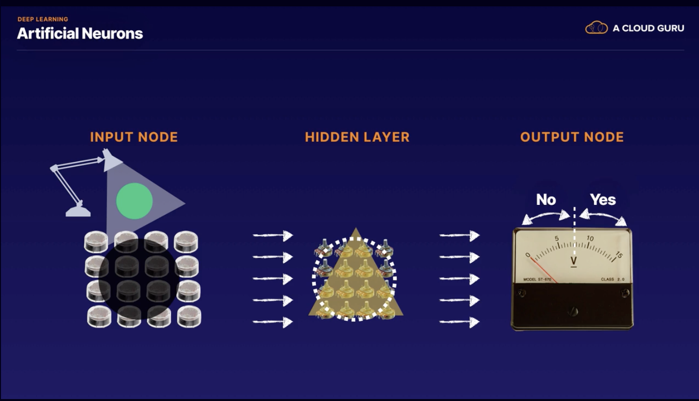
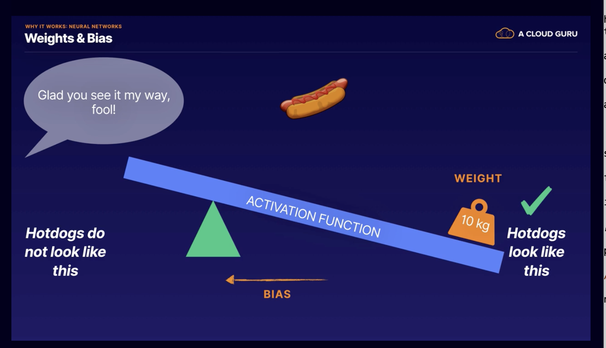
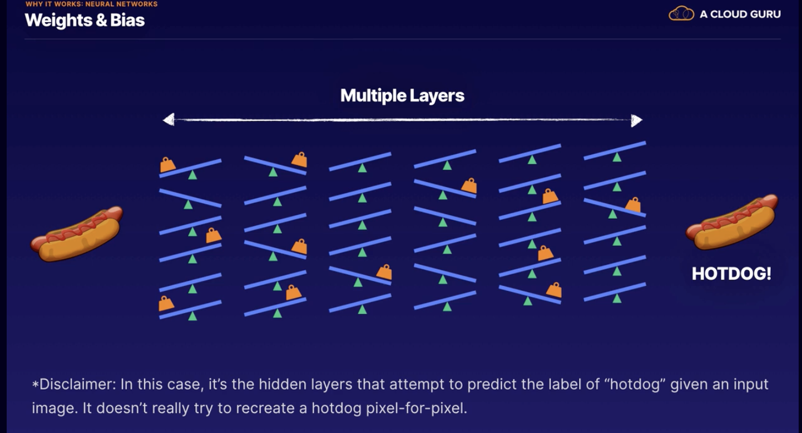

# Introduction to machine learning

## Section 2: History of machine learning

### Brief history of AI and ML 

- 'Electro' - robot from Westinghouse

- Talos - greek mythology, automaton

- Original computer programmers - manual switches and wiring

- Alan Turing - Automatic Computing Engine

- Turing - "Can machines think?"
 - Imitiation game/Turing test
 
- First Artificial intellegence program: Newell, Simon, 1955
 - Logic theory machine
 
- Early proposal for questions in "Artifiical Intelligence"
 - Automatic computers
 - How can a computer be programmed to use a language
 - Neuron nets: mimic the brain
 - Theory size of a calcualtion
 - Self-improvement
 - Abstraction
 - Randomness and creativity
 
Theorem: the past explains the present and gives us some intuition about the future

### Difference between AI, ML, statistics and data science

Arthur Samuel: Pioneer of computer gaming
 - Made program that plays checkers
 - Demonstrated reinforcement learning
 
#### Data science and Machine learning

Both: 

 - Uses computing power
 - Usually large sets of data
 - Lots of math

Data science:

 - Analyse the data to draw conclusions
 
 
Machine learning:

 - Attempts to perform tasks without explicit instructions
 
#### Artificial intelligence

Topics in AI include:

 - Expert systems
 - Speech
 - Natural language processing
 - Vision
 - Machine learning
 - Neural networks
 - Robotics

Common theme is building systems that figure things out on their own, or at least simulate that ability

#### Machine learning

Topics:

 - Ensemble
 - Reinforcement
 - Supervised
 - Unsupervised
 - Semi-supervised
 - More to come....
 
#### Machine learning models

What is a model?  Taking a problem or challenge as described by lots of data, adding a machine learning algortihm and, through computation, trying to digure out a mathematical formula that can accurately generalize about that problem.

Algorithm: 

 - unambiguous specification of how to solve a class of problems
 - Set of steps to follow to solve a specific problem
 - Intended to be repeatable with the same outcome

Heuristic:

 - A mental shortcut or 'rule of thumb' that proivides guidance on a task
 - Does not guarantee a consistent outcome
 
Example: troubleshooting why a computer doesn't work

Algorithm - set of steps that you can take to narrow down to the cause

Heuristic - educated guess 

Sometimes, we use heuristics because we just want a (cheap) answer that is 'good enough', rather than an (expensive) answer that is perfect

### Understand why computers compute 

#### Binary number systems

Binary numbering system: places represent powers of two.

Each position: bit
Eight bits: Byte

Each byte: 256 possible combinations

#### Logic gates

The basic building blocks of most modern computers

A debate between George Boole vs Sir William Hamilton prompted Boole to develop a system of logic that uses two states (TRUE, FALSE).

Digitial logic gates are an application of boolean logic

An AND gate: two inputs, one output; true if both inputs are true
An OR gate: two inputs, one output; true if one input is true
A NOT gate: one input, one output; true if input is not true

Two gates in series: AND and NOT - NAND: only false if both inputs are true

NAND gate is 'universal' - can build any other gate type with combinations of NAND gates

#### Challenge lesson: logic gates

Challenge - design a circuit that adds two numbers using only one circuit element

The hints were:

Use [logic.ly](https://logic.ly) to explore circuits.

The solution, using different kinds of logic gates

The solution, using only one kind of logic gate (NAND)

This is different to mine... But there are different solutions

## Data

Learning objectives:

1. Understand the different types of data
2. Understand the difference between structured, unstrctured and semi-structured data
3. Common ways we provide context to data

Key words:

 - schema
 - tensor
 - aggregation
 - normalization
 - feature engeineering
 
### Intro to data

The human computer: 100 billion neurons in a human brain.  Neurons have many more connections than transistors.  Intelligencs is more than logic.  Data drives intelligence.

Top layers are intelligence: 

 - Wisdom is knowledge over lots of time
 - Knowlege is making sense of information
 - Information is a collection of summarised things
 - Generalizations, probabilities, conclusions are tricks to summarise and understand

Structured data: 
 - adheres to some rules or formats that we can count on
 - easy for computers to access
 - examples: name, time, weekday
 
Unstructured data: 
 - data that isn't a format that we can count on 
 - hard for computers to access
 - example: picture, block of text, form, restraunt review
 
Semi-structured
 - in between structured and unstructured
 - brings along it's own strcture
 - e.g. JSON, YAML files
 
The goal of machine learning is often to structrure data more

## Data context

Context provides the "backstory" for data:

 - Where did it come from?
 - Who created it?
 - How was it collected or generated?
 - Is it trustworthy?
 
A schema: 

 - predefined blueprint of how data is structured and related
 - provide context for storing, reading and interpreting data
 - an entity relationship diagram is one way of representing a schema

A cannonical model:

 - a common format for exchanging data among systems
 
Data types:

 - integers
 - floating point
 - decimal (fixed number of decimal places)
 - bigint, smallint: integers when we had to care about memory usage
 - character
 - string
 - blob: binary large objct; video; audio; file
 
Composite datatypes:

 - tuple: a number of items (integers, characters, etc) in a list
 - array: a collection of items where each item can be identitfied by an index or key (e.g. dict) (sometimes called a vector)
 - matrix: an array in two dimensions
 - tensor: a collection of matrices / a generic multidimensional array
  - 1-D tensor / first order tensor: array
  - 2-D tensor / second order tensor: matrix
  - tensor: collection of matrices
  
Tensors are used for image regcnonition.  Images are broken up into RGB components - one matrix for red, one for green, one for blue

### Data preparation

Most of the work in developing machine learning models is in data preparation: cleaning, scrubbing, sanitising

Common problems:

 - formatting: e.g. data in columns not all the same type
 - missing values
 - duplicates
 - invalid data
 - encoding
 
 
STeps in data prepration:

 - Cleaning: sorting out these issues
 - Aggregation: summarising the data through consolidation
 - Transforming: converting to another format, unit or value
 - Normalisation: scale values relative to a constant value
 - Visualisation: gives us insights that we can't see just by looking at the data
 
Feature engineering: getting the data into the best possible shape for machine learning

### Data sets

We're after generalizations, not memorizations, if we want to learn from the data.  To do this, we often hold back some data when training the model to assess the generalisability of the model:

 - training dataset: for training model
 - validation dataset: 'check point' to see how training is going
 - testing dataset /  hold-out dataset: hold-back for testing final model

A reasonable split is 70-80% of the data for training the model, 20-30% of the data for testing.  An alternative is 70% training, 15% validation, 15% testing.  

The split should keep representative data in each set.  So it's important to randomise data before splitting.

But how to split time series data?  Time plays an important part in the context of the data, so we can't just take random days, or one period of time.  So we probably want the most recent data as the hold-out data.  But it can be very difficult to predict patterns that weren't in the training data

### Why it works

Example from history: building a ship that didn't work.  Two different rules found on ship, with two different measurement units. Same thing happend with mars climate orbiter.

Objective: group pepper plants into similar clusters based on data about their growing conditions, pepper yield, and 'spiciness' (Scoville Units). 

First convert to same units.  Then do min/max scaling - get temperature range (max-min), then subtract minimum from all values, then divide by range.

Min/max scaling is useful when there's a defined range of values that are of interest, but doesn't work that well when there isn't a defined upper limit.

Need to make sure that there isn't a column with a set of values very different to the other values.

We might perform standardisation (or Z-score normalisation) on the 'spiciness' column.  We compare the values to a standard curve

Mean normalization: similar to min/max normalisation but use average instead of mean to scale

### Lab: Data exploration

Background: you're a data analyst for a new internet service that wants to use high altitude balloons to provide wereless internet service for remote and rural areas around the globe.  Bermuda has been chosen as a test market; the task is to decide if this is a good idea.

Criteria for a good test market:

 - Low service penetration: existing internet service penetration for population should be under 50%, indicating a sufficient available market for new subscribers
 - Upward trend in mobile: mobile usage should be consistently growing over the past 10 years, indicating growing popularity of a connected lifestyle
 - Declining landline service: landline subscribers tend to get their internet access via their existing landline provider at a much cheaper price point than the target price of the new service
 
Objective:

 - Determine through quantative reasearch if Bermuda meets all of our criteria 
 
Solution:

Google has a feature to search for [public datasets](https://www.google.com.au/publicdata/directory).

Go to world bank website to get the data.  Check landline usage, internet penetration, 
 

## Supervised and unsupervised learning

Learning objectives:

1. Broadly understand supervised learning nad some common supervised learning methods
2. Broadly understand unsupervised learning nad some common unsupervised learning methods
3. Evaluate whether supervised or unsupervised leraning approaches are appropriate for given use-cases

Key words:

 - Stochastic gradient descent
 - k (as in k-means, k-nearest neighbours)
 - convergence
 
### Kinds of machine learning

Broadly, supervised learning, unsupervised learning, and reinforcement learning.

Supervised: a teacher supervised the learning process by providing examples and feedback

 1. Gather examples
 2. Choose an algorithm
 3. Train model
 4. Check how we're doing (testing)
 5. Make new predictions
 
Unsupervised: don't have examples of what to expect

 1. Choose our algorithm
 2. Feed in the data
 3. Train model
 4. Make some groupings
 
Reinforcement learning: model that seeks to maximise reward, usually through trial and error

1. Try random stuff
2. Collect data from attepts
3. Train model
4. What action gives best reards
5. Make improvements
6. Back to step 1

How to choose a model type?

 - What problem are you trying to solve?
 - What data do you have to work with?
 - What data type do you have?
 - How must you produce results?
 
## Supervised learning

 1. Gather examples
 2. Choose an algorithm
 3. Train model
 4. Check how we're doing (testing)
 5. Make new predictions

In other words:

1. Gather round truth (data): a collection of data examples that you know to be accurate and representative of the types of scenarios you want to generalize
2. Reverse engineer a mathematical description of patterns
3. Test our pattern formula
4. Use our formula on similar data

### Regression

Regression: helps uncover relationships between data points and ultimately build models to predict new data points.

Linear regression: adjust to minimize error.  One way of fitting is stochastic gradient descent.

Stochastic gradient descent: a way to find degree of error in order to adjust and improve our ML model

Convergent: Finding a minima in error function.  Could be global or local

### Classification

Data have particular classes, or 'labels'

k-nearest neighbours: way of classifying data into groups. Use k attributes to group data.

## Unsupervised learning

Hebbian theory: you can figure stuff out on your own by associations

 1. Choose our algorithm
 2. Feed in the data
 3. Train model
 4. Make some groupings
 
 When to use:
 
  - Unlabelled data
  - Training is not feasible (e.g. pattern recognition)
  - Performance
  
Examples of unsupervised learning:

 - Clustering
 - Data compression
 - Associations : uncover relationships between things that weren't obvious
 - Anomaly detection
 
### Clustering

Group things such that they are with things that are more similar than different

No training data - different to supervised

k-means analysis: group data into k clusters

## Reinforcement and ensemble learning

### When enough is enough

When to stop training? Consider:

 - Mathematical enormity of our problem space
 - Time and resources
 - **Risk of overfitting**
 - Pursuit of perfection
 
What is overfitting?  "Memorising" the data, resulting in a model that doesn't generalize well.
 

We can also have underfitting, where the model doesn't describe the data well.

How to avoid overfitting:

 1. More data
 2. Stop training
 3. Ensembles - combining different traning approaches
 4. Sprinkle in some noise
 
Entropy: A measure of the amount of randomness

### What is learning

Pavlov's dog - reinforcement learning, 'involuntary'

Thorndike's cats in puzzle boxes.  Law of effect: responses that produce a desired effect are more likely to occur again

Skinner's: law of effect --> operant conditioning, considered 'voluntary'

Desirable effects: reinforcement
Unpleasant effects: punishment
 
### Reinforcement learning

Ron Howard: Dynamic programming and Markov processes

DeepRacer: model car 

Concepts in markov decision process:

 - Agent: Car
 - Environment: Road
 - State: Where the car is in the environment
 - Observation: Cameras, etc to observe environment
 - Action: Given state and observation, do something
 - Reward: The outcome of the action
 - Policy: How to decide which actions to take
 
### Ensemble learning

Using multiple machine learning processes together to get a better result.

Decision tree example - factors that influence house price

Random Forest - divide up attributes into trees

### Challenge lab - self-driving car

Mission - train a car to drive by itself

Expert path: AWS deep racer
Intermediate path: MetaCar project

## Deep learning

History and cycles in ideas in the field

Early neural network - MADELINE - noise on phone lines

Hinton and colleagues - uses of neural networks, "deep learning"

### What is deep learning?

Neurons - form networks

Deep learning tries to mimic these networks

Input node, hidden layer, output node

Early example - perceptron machine which did binary classification

This is kind of simple - and only does one thing that we can do more easily other ways.  But Adding lots of hidden layers make neural networks much more flexible.

### How do neural networks work

Think of each decision point in the hidden layer as an 'activation function' - kind of like a logic gate, but probably more sigmoid.

Training phase - feed in labelled data, adjustments made to hidden layers by adjusting the weights and biases of the activation functions.

Backpropagation: iteratively moving back through a neural network and adjusting the weights to minimise the error at the output layer.

### Convolutional neural networks

How do computers see?  Look at how we see. Image falls on retina -> occiptial lobe -> visual cortex.

Picture represented as RGB (and maybe alpha). Feed image into input node, and it propagates through network.

Hidden layer contains 'filters', which recognise features like edges, corners, etc.  The matrix multiplication that combines the image with the filters is called convolution, so these networks are often called convolutional neural networks.

### Comprehending meaning

Need to understand information and context to comprehend meaning.

Recurrent neural networks are useful for understanding context.  In these networks, there are lots of recurrent connections in the hidden layers.  This helps it consider many parts of the same set of information together.

Recurrent neural networks are often used for speech and language comprehension.

Generative adversarial networks.  Generator tries to trick discriminator into thinking its output is a real picture of a face.  Asimov institute has a list of common network types.

